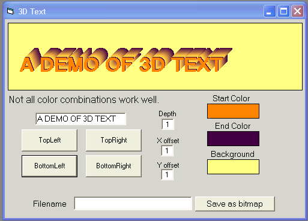



## My 3D Text \(My 2 cents worth\)

### Description

I was going through my code snippets and threw this together. I thought it might have some use to someone. If not, I'll try again. Besides that, it was fun to do.
 
### More Info
 

             |
---                |---
**Submitted On**   |2006-02-28 21:29:40
**By**             |[Kenneth Foster](https://github.com/Planet-Source-Code/PSCIndex/blob/master/ByAuthor/kenneth-foster.md)
**Level**          |Intermediate
**User Rating**    |5.0 (45 globes from 9 users)
**Compatibility**  |VB 6\.0
**Category**       |[Graphics](https://github.com/Planet-Source-Code/PSCIndex/blob/master/ByCategory/graphics__1-46.md)
**World**          |[Visual Basic](https://github.com/Planet-Source-Code/PSCIndex/blob/master/ByWorld/visual-basic.md)
**Archive File**   |[My\_3D\_Text1977102282006\.zip](https://github.com/Planet-Source-Code/kenneth-foster-my-3d-text-my-2-cents-worth__1-62457/archive/master.zip)

